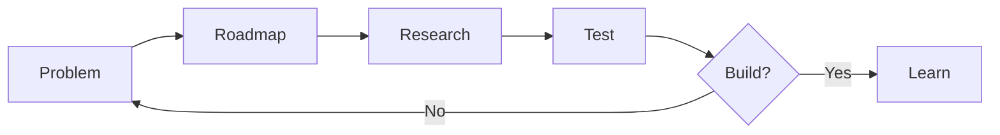

# The Process

**Last updated:** October 5, 2026

How a project goes from a problem to shipped work.

## The flow

### 1. Identify the Problem

- For each roadmap item, idea, and/or task, identify the problem it solves and what success looks like. If a problem can't be identified, hold off on designing a solution. Success can only be claimed when a problem is resolved, not when a product ships.

### 2. Research: The value of research/competitive analysis

- When doing a competitive analysis, the biggest value a competitor feature provides is insight: What problem were they hoping to solve, and is there a better or more current/agentic solution? Use competitor solutions in your ideation ONLY when it is truly the best solution to solve the problem they were trying to solve. 
- All research needs a source. No exception. When you provide information, make sure I can read the source material. Every fact you give me should also come with a source link. If you estimate a detail or fact, label it with an "Estimate" tag.

### 3. Research: User Testing

- Multiple small sessions with real people, recorded and documented, beat out a large one-time study at the end of a project every time. 
- User tests results provide valuable insight.
- When a user offers suggestions or provides a wishlist, remember the user does not know what the user does not know. Their solution might not be the best.
- Instead, use that information to help determine what problem they were hoping to solve. And is there a better or more current/agentic solution?
- Consider a user's suggestion for improvement ONLY when it is truly the best solution to solve that problem.

### 4. What is the Roadmap? What should it include?

- After a problem has been clearly identified, assign it to the Roadmap, and clearly identify what success looks like. Assign milestones (if needed) to indicate progress toward the solution if there are multiple jobs to be done.

- Limit milestones to three max.
- Ideation that isn't on the roadmap is documented and stored in the backlog. 
- A problem can move from Idea → Researched → My Decision → Decided
- Only when an idea reaches "Decided" can it be added to the roadmap.
- Each roadmap problem becomes a task and is listed on the GitHub Issues tab.
- Every task clearly states the "Problem to solve" and "What Success Looks Like." Big work becomes a parent issue with sub-issues, in the order they depend on each other.

### 5. Growth Mindset

- This process should always be seen through the lens of growth mindset. It is a living and breathing document. Consider it a source of truth, but be open to suggesting your own opinions to improve the process along the way. 

## My Learnings
For the best results, use these learnings to help inform your decisions and provide feedback

**Skills I have written and customized:**
- [/product-manager](skills/product-manager/SKILL.md) for planning
- [/product-designer](skills/product-designer/SKILL.md) for page layout and information architecture
- [/ux-writer](skills/ux-writer/SKILL.md) for writing copy
- [/product-engineer](skills/product-engineer/SKILL.md) for software architecture and writing/maintaining code

**The skills keep getting better.** 

- Each skill reviews itself after a task and proposes any changes to improve my skills, to help me improve my skill creation development, and help me to grow as a designer. Its change log shows what changed and why.

**Each change triggers a pull request.** 
- Code, docs, and the wiki all change through pull requests I review and merge. Keeping a history of how the skills change, tells a story and helps AI learn how to give better prompt results.
- The GitHub Wiki pages are a project's documentation and live in the repo and are published when updates are merged
- ([template](templates/publish-wiki.yml)).
  
**Decisions are always logged and findable:**

- Who decided, what they decided, why they decided it, when they decided it, and
- Was anything else considered? If so, what?/why was it disregarded?
  
**Documents are easy to find.** 

- Each project has one Documents page that acts as an index, listing every document associated with that project, and a link to where it is hosted
- ([template](templates/Documents.md)).
- Private files stay private. Never store personal PPI or PHI in a public repo

**Share what we learn.** 

- When we learn something new, ask: would this help every project?
- If yes, it goes here in how-i-work.
- If a learning only matters to one project, it stays in that project.
- Stay true to my single source of truth philosphy, Documents remain where they were created and are NOT COPIED.
- To avoid muddying the data. Provide a link to the original and show a view only solution.

**Projects stay in step with the templates.** 

- When a project's CLAUDE.md changes, make sure you are updating [the template](templates/CLAUDE.md) as well.
