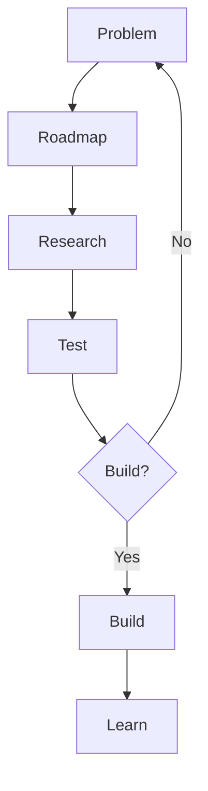

# The process

**Last updated:** September 26, 2026

How a project goes from a problem to shipped work. AI drafts; I decide. Nothing changes without my yes.

## The flow

### 1. Problem: name it first

Every roadmap item, idea and task names the problem it solves and what success looks like. If the problem can't be named, it isn't ready. Success means the problem got solved, not that something shipped on time.

### 2. Roadmap: pick what to solve

Now, Next, Later: the problems being solved and the milestones that show they're solved, readable in 3 seconds.

Ideas that aren't on the roadmap wait in the backlog. They move from Idea → Researched → my decision → Decided, and only a decided idea joins the roadmap. Many never do, and that's fine.

### 3. Research: check before building

- Competitor features get one test: what problem does it solve, and is there a better or more current way? Copy only when there isn't.
- Small, easy-to-undo choices need a sourced principle. Big bets need evidence from real people.
- Every fact gets a source link, or a label saying it's an estimate.

### 4. Test: small and cheap

Usability sessions and small tests with real people, before the big build.

### 5. Build? Let the results decide

The test results decide: build one route, or stop and rethink the problem. Stopping early is a win; it saves the months a wrong build would cost.

### 6. Build: in small tasks

Each roadmap problem breaks into tasks in GitHub Issues. Every task states its problem and "done when." Big work becomes a parent issue with sub-issues, in the order they depend on each other.

### 7. Learn: improve and repeat

Track what people actually do, fix what gets in their way, and feed new problems back to step 1.

## Along the way

These apply at every step.

- **Skills do the craft:** [/product-project-manager](skills/product-project-manager/SKILL.md) for planning, [/product-designer](skills/product-designer/SKILL.md) for structure and screens, [/content-writer](skills/content-writer/SKILL.md) for every word, and [/portfolio-frontend-build](skills/portfolio-frontend-build/SKILL.md) for the code.
- **Every change is a pull request.** Code, docs and the wiki all change through pull requests I review and merge. Wiki pages live in the repo and publish on merge ([template](templates/publish-wiki.yml)).
- **Decisions get logged:** who decided, why, and what else was considered.
- **Everything stays findable.** Each project has one Documents page listing every document and when to open it ([template](templates/Documents.md)). Private files stay private, never in a public repo.
- **The skills keep getting better.** Each one reviews itself after a task and proposes one change for me to approve. Its change log shows what changed and why.
